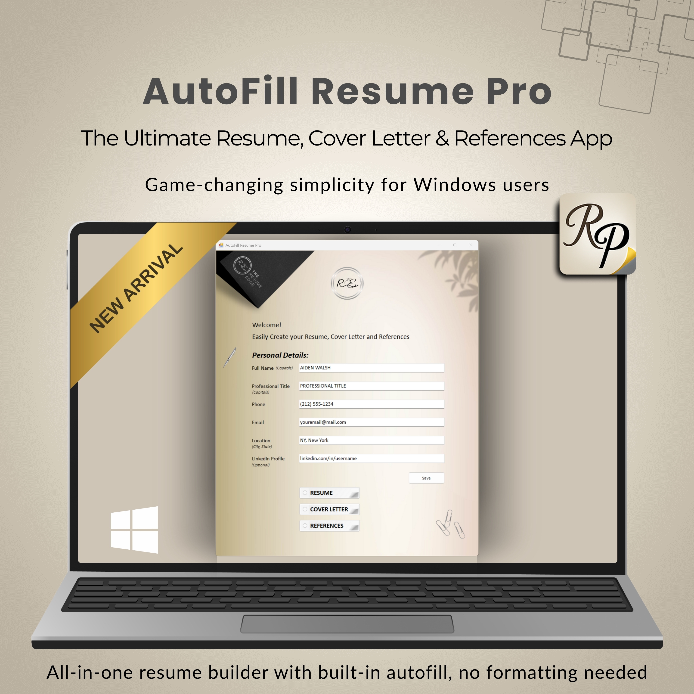
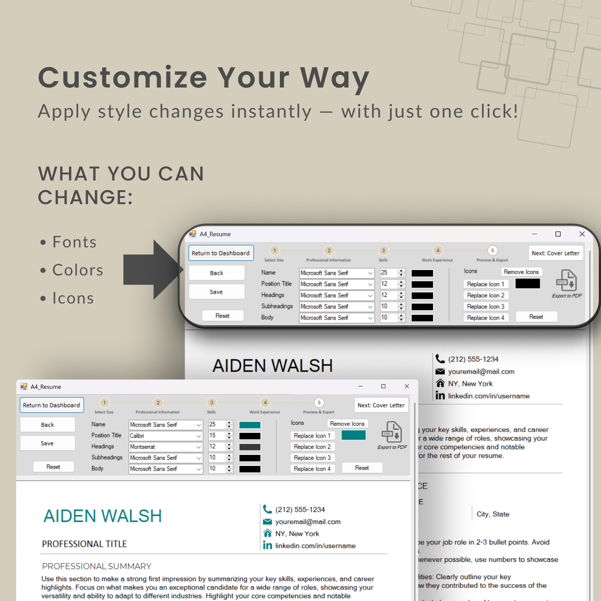
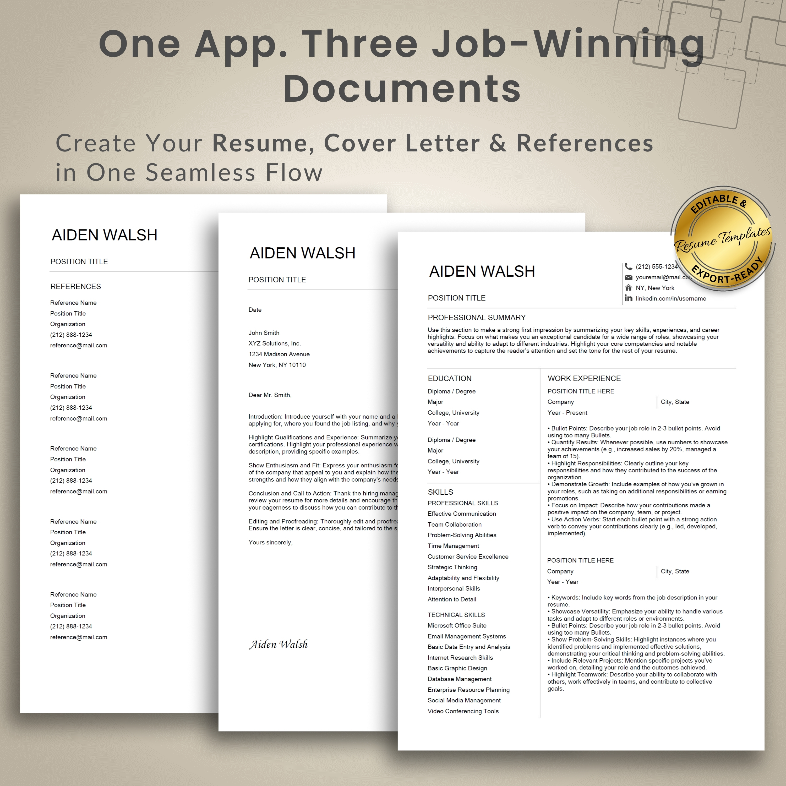

# AutoFill_Resume_Pro

Windows desktop app (C# WinForms) that builds resumes, cover letters, and references with export to PDF.

## 🚀 Features
- Resume, Cover Letter & References in one flow
- A4 & US Letter presets
- Theme options (fonts, colors, icons)
- Polished PDF export and autosave

- ## 💻 System Requirements
- Windows 10/11 (x64)
- ~150 MB free disk space

## 📦 Download
- Installer (latest): [Download here](https://github.com/Shenene/AutoFill_Resume_Pro/releases/latest)
- Source code: [View on GitHub](https://github.com/Shenene/AutoFill_Resume_Pro)

## 🖼️ Screenshots
### Welcome Screen

### Customization

### Final Export

👉 See all screenshots in the [docs/screenshots](docs/screenshots) folder.

## 📽️ Demo Videos
- [Quick 15-second Demo](https://youtube.com/shorts/zoEome7d3f4)  
- [Installation Guide](https://youtu.be/qsGv6CdSOh0)  
- [Full Walkthrough](https://youtu.be/T0b2UR5klJ8)

## 🔒 Privacy
- All documents are created locally on your computer.  
- AutoFill Resume Pro does not collect, upload, or store any personal data.  

## ⚠️ SmartScreen
Unsigned installers may trigger Windows SmartScreen.  
If you see a warning, click **“More info” → “Run anyway”** to proceed.  
This is normal for indie/dev projects that don’t buy a code-signing certificate.  

## 📜 License
- Portfolio/demo project  
- Free for personal use (you may create your own CV/resume with the app)  
- Not for resale, redistribution, or commercial use  
- © The Resume Edge. Developed by Shenene Carstens.  
See [LICENSE.md](LICENSE.md) for full terms.
